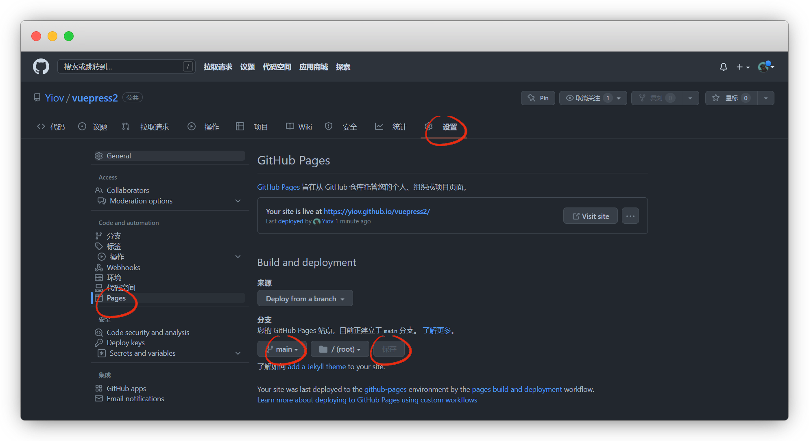

# 静态部署

::: warning 更新时间
最近更新：2023-7-15

搭建版本：v2.0-beta.66
:::

主要讲一下GitHub，其他的方式都大同小异，[更多部署方式可以参考官方文档](https://v2.vuepress.vuejs.org/zh/guide/deployment.html)


## Base

::: warning 注意

base必须配置，否则打包会丢失css样式！！

根目录配置 `/`，那么对应 `https://yiov.github.io/`

仓库 `vitepress` 配置 `/vitepress/` ，那么对应 `https://yiov.github.io/vitepress`
:::

我们根据自己的需求，选择相应的的配置

```ts{2-3}
export default {
  base: '/', //网站部署的路径，默认根目录
  // base: '/vuepress/', //网站部署到github的vuepress这个仓库里
}
```


::: warning 注意
如果你base设置成其他仓库后，你的fav图标也要变动一下
:::


```ts{2,6}
export default {
  base: '/vuepress/', //网站部署在vuepress仓库

  head: [['link', 
  //favicon图标也要改成仓库名路径，否则丢失
  { rel: 'icon', href: '/vuepress/images/logo.png' },]],
}
```


## 配置工作流

新建文件 `.github/workflows/docs.yml` ，将下面yml信息粘贴进去

```
├─ docs
├─ .github
│    └─ workflows
│         └─ docs.yml  <--- yml工作流
└─ .gitignore
```

::: tip 注意
.github 与 docs为同级目录，有兴趣[GitHub Actions 深入了解](https://docs.github.com/zh/actions)
:::


::: warning 注意
经过反复测试，还是没搞定，于是弃用了

这是一个已经配置好的工作流，自己记得删掉注释！！！

实际是github分配了一个虚拟机给你使用，里面的ubuntu系统以及pnpm都是虚拟机使用的，与自己的无关，不要动就行
:::


::: details 点击查看代码
```yml
name: docs

on:
  # 每当 push 到 main 分支时触发部署
  push:
    branches: [main]
  # 手动触发部署
  workflow_dispatch:

jobs:
  docs:
    runs-on: ubuntu-latest

    steps:
      - uses: actions/checkout@v3
        with:
          # “最近更新时间” 等 git 日志相关信息，需要拉取全部提交记录
          fetch-depth: 0

      - name: Setup pnpm
        uses: pnpm/action-setup@v2
        with:
          # 选择要使用的 pnpm 版本
          version: 8
          # 使用 pnpm 安装依赖
          run_install: true

      - name: Setup Node.js
        uses: actions/setup-node@v3
        with:
          # 选择要使用的 node 版本
          node-version: 18
          # 缓存 pnpm 依赖
          cache: pnpm

      # 运行构建脚本
      - name: Build VuePress site
        run: pnpm docs:build

      # 查看 workflow 的文档来获取更多信息
      # @see https://github.com/crazy-max/ghaction-github-pages
      - name: Deploy to GitHub Pages
        uses: crazy-max/ghaction-github-pages@v2
        with:
          # 部署到 gh-pages 分支
          target_branch: gh-pages
          # 部署目录为 VuePress 的默认输出目录
          build_dir: docs/.vuepress/dist
        env:
          # @see https://docs.github.com/cn/actions/reference/authentication-in-a-workflow#about-the-github_token-secret
          GITHUB_TOKEN: ${{ secrets.GITHUB_TOKEN }}
```
:::


## 网站部署

如果不想要自动化部署到网站，可以通过命令打包

::: tip 说明
默认的构建输出目录 `.vuepress/dist`
:::


:::: code-group
::: code-group-item pnpm
```sh
pnpm docs:build
```
:::
::: code-group-item yarn
```sh
yarn docs:build
```
:::
::: code-group-item npm
```sh
npm docs:build
```
:::
::::


打包完成后，在 `docs/.vuepress/dist` 目录，将`dist`上传到网站或者仓库即可




手动上传到github的，需要在设置-page里把分支改成main，默认root，保存等创建成功后即可获得访问链接


