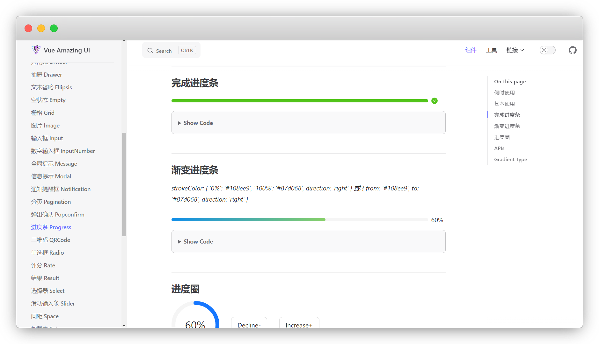

# 组件

::: warning 更新时间
最近更新：2023-8-16

搭建版本：v2.0-beta.66
:::

## 基本组成

组件由三部分组成：`<template>` `<script>` `<style>`

::: tip 对应关系
template 对应 html

script 对应 js

style 对应 css
:::


## 安装注册插件

v2版都要自行安装了

:::: code-group
::: code-group-item pnpm
```sh
pnpm add -D @vuepress/plugin-register-components@next
```
:::
::: code-group-item yarn
```sh
yarn add -D @vuepress/plugin-register-components@next
```
:::
::: code-group-item npm
```sh
npm i -D @vuepress/plugin-register-components@next
```
:::
::::


```ts{1,5-7}
import { registerComponentsPlugin } from '@vuepress/plugin-register-components'

export default {
  plugins: [
    registerComponentsPlugin({
      // 配置项
    }),
  ],
}
```


## 别名路径

组件目录默认放在 `components` 文件夹中

```
└─ docs
   └─.vuepress
      └─ components   <- 组件目录
         └─ test.vue
```

我们还要安装别名路径，才能全局引用

:::: code-group
::: code-group-item pnpm
```sh
pnpm add -D @vuepress/utils@next
```
:::
::: code-group-item yarn
```sh
yarn add -D @vuepress/utils@next
```
:::
::: code-group-item npm
```sh
npm i -D @vuepress/utils@next
```
:::
::::


```ts{1,3,7-9}
import { getDirname, path } from '@vuepress/utils'

const __dirname = getDirname(import.meta.url)

export default {
  plugins: [
    registerComponentsPlugin({
      componentsDir: path.resolve(__dirname, './components'),
    }),
  ],
}
```

## 演示：进度条

对于我这种还不会Vue的小白，我们直接用别人写好的插件

Vue Amazing UI：[https://themusecatcher.github.io/vue-amazing-ui/](https://themusecatcher.github.io/vue-amazing-ui/)

我用进度条演示



在 components 文件夹创建 `Progress.vue`，然后在 [仓库](https://github.com/themusecatcher/vue-amazing-ui/blob/master/packages/progress/Progress.vue) 把代码复制过来


在代码style-lang中还有less需要安装


:::: code-group
::: code-group-item pnpm
```sh
pnpm add -D less
```
:::
::: code-group-item yarn
```sh
yarn add -D less
```
:::
::: code-group-item npm
```sh
npm i -D less
```
:::
::::


然后我们在README.md文档中引用

```vue
<Progress></Progress>
```

我们还要输入进度条的百分比，以及加一个渐变色

```vue
<Progress width="100%" 
:percent="99" 
:strokeColor="{
    '0%': '#108ee9',
    '100%': '#87d068',
    direction: 'right'
  }">
</Progress>
```


<Progress width="100%" 
:percent="99" 
:strokeColor="{
    '0%': '#108ee9',
    '100%': '#87d068',
    direction: 'right'
  }">
</Progress>

