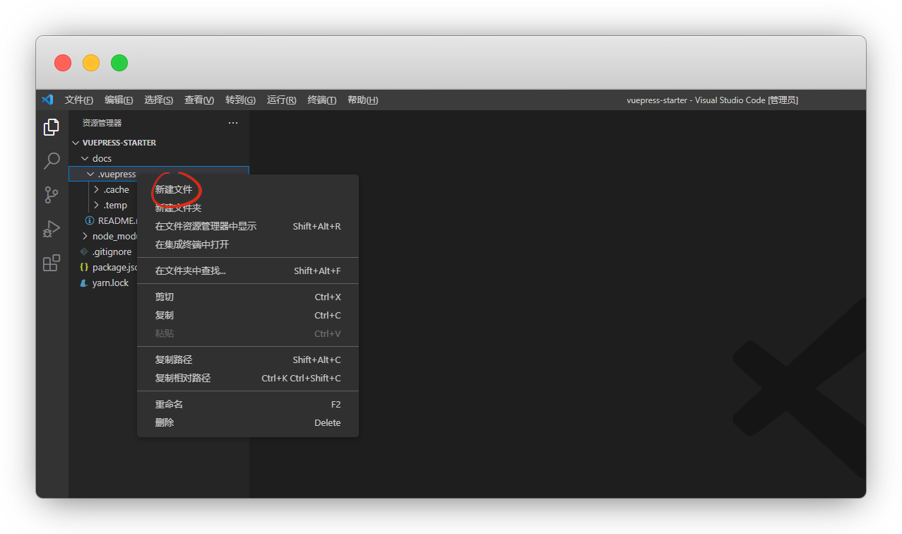
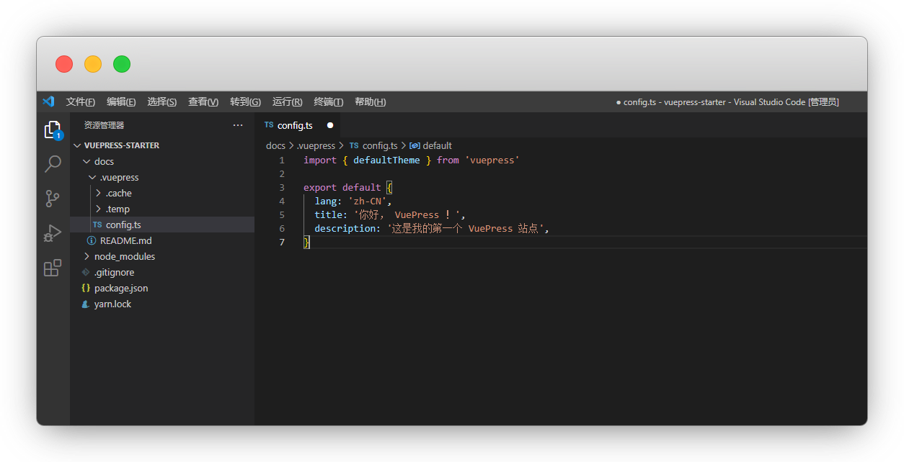
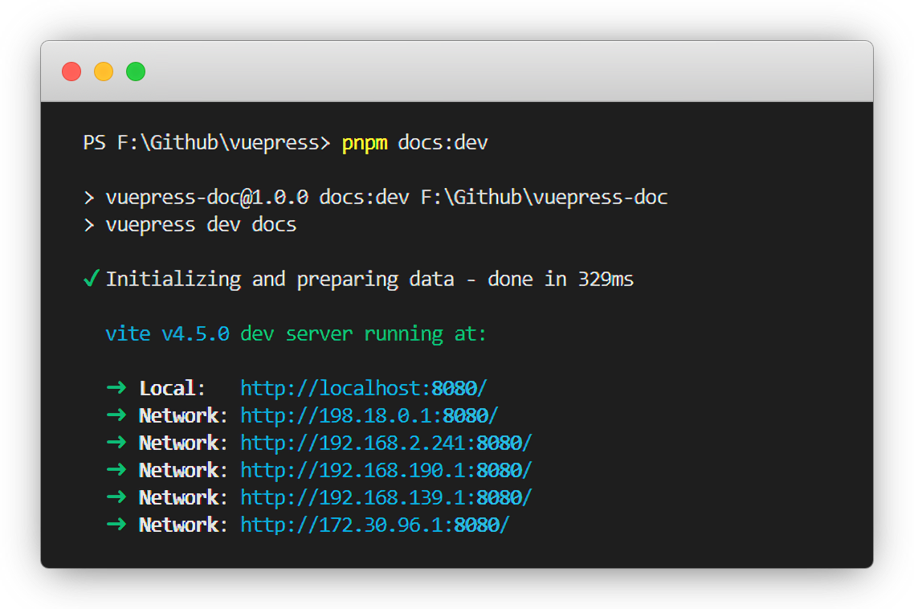
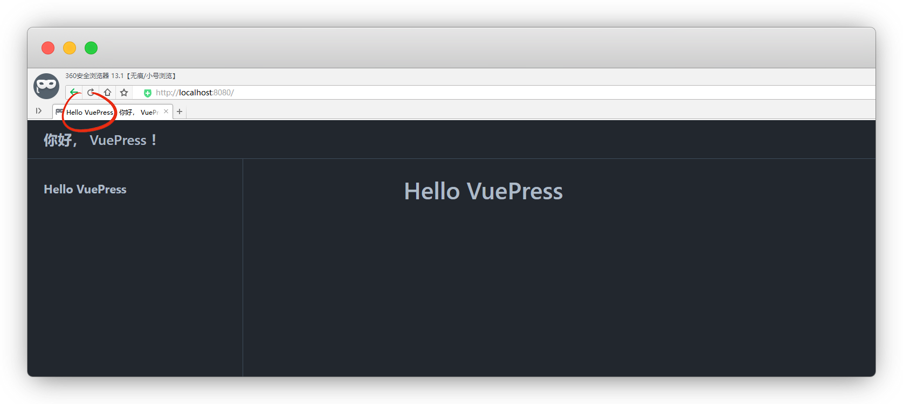
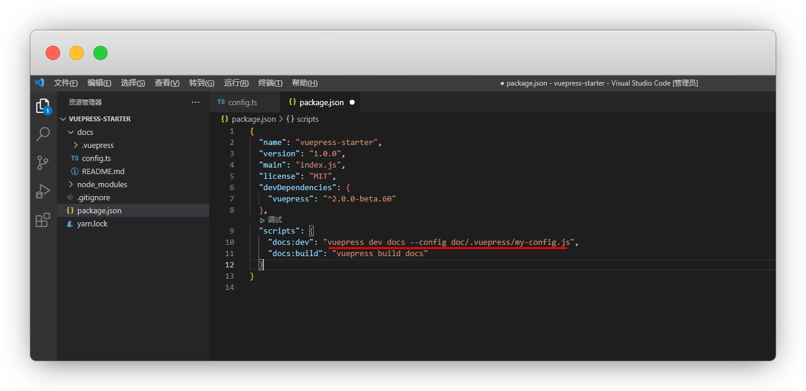

# 配置

::: warning 更新时间
最近更新：2023-7-15

搭建版本：v2.0-beta.66
:::

完成搭建后，我们就对页面进行配置

## 站点配置

在`.vuepress`目录下创建一个 `config.ts`文件

::: tip TS和JS
官方的文件目录里列表的也是config.ts，作者推荐的也是ts

JavaScript 格式为 config.js

TypeScript 格式为 config.ts
:::

```
├─ docs
│  ├─ .vuepress
│  │  └─ config.ts   <--- 配置文件
│  └─ README.md
├─ .gitignore
└─ package.json
```

我们安装了vscode，直接用它打开 `通过code打开`，新建`config.ts`文件

> 鼠标右键没有，是因为你没有[安装vscode](https://yiov.top/daily/VSCode/)





复制下面代码，粘贴并保存！

```ts
import { defaultTheme } from 'vuepress'

export default {
  lang: 'zh-CN',
  title: '你好， VuePress ！',
  description: '这是我的第一个 VuePress 站点',
}
```



`Ctrl` + ` 键，打开vscode终端，重启一次

:::: code-group
::: code-group-item pnpm
```sh
#开发环境
pnpm docs:dev
```
:::
::: code-group-item yarn
```sh
#开发环境
yarn docs:dev
```
:::
::: code-group-item npm
```sh
#开发环境
npm docs:dev
```
:::
::::

::: tip 使用说明
每次配置完都需要重启才能生效

方向键 `↑键` ，可快捷调用上次命令
:::



标签栏位置就有变化了




## 配置文件（可选）

::: warning 注意
除非你很了解它，否则不要轻易改动
:::

在 `package.json` 里添加

```json{3-4}
//绝对路径，my-config名称可以自己改
"scripts": {
    "docs:dev": "vuepress dev docs --config doc/.vuepress/my-config.js",
    "docs:build": "vuepress build docs"
  }
```




你也可以选择命令行添加

```sh
vuepress dev docs --config my-config.js
```


## 客户端配置文件(可选)

像我这种小白，基本很难用到了，有些代码基础的可以了解一下

```目录
├─ docs
│  ├─ .vuepress
│  │  ├─ client.ts   <--- 客户端配置文件
│  │  └─ config.ts
│  └─ README.md
├─ .gitignore
└─ package.json
```

步骤也是一样的，在 `.vuepress` 目录下新建一个 `client.ts`文件

一个基础的客户端配置文件是这样的：

```ts
import { defineClientConfig } from '@vuepress/client'

export default defineClientConfig({
  enhance({ app, router, siteData }) {},
  setup() {},
  rootComponents: [],
})
```


