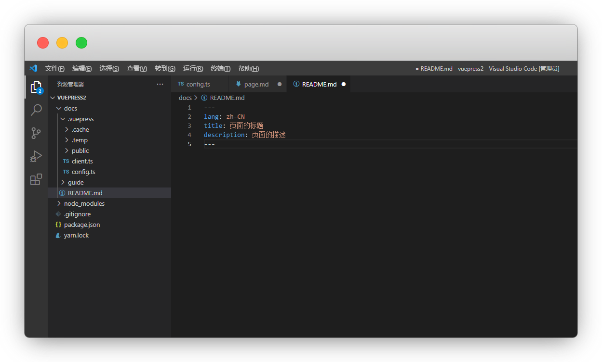
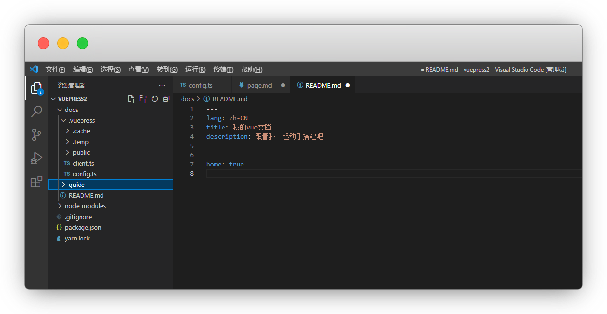
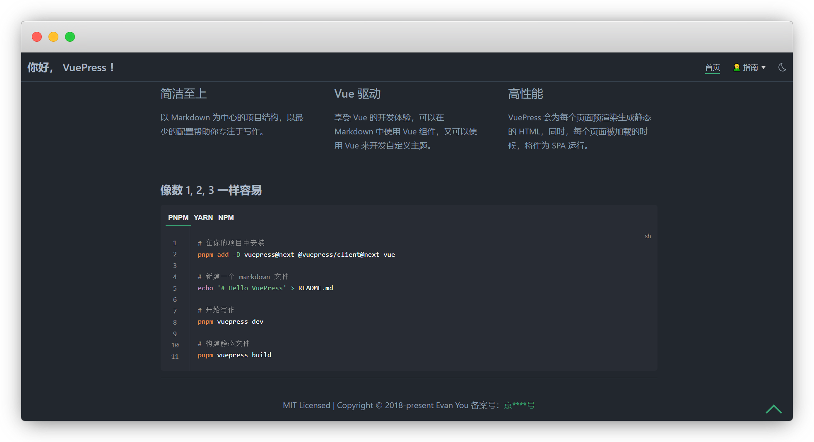

# Frontmatter

::: warning 更新时间
最近更新：2023-7-15

搭建版本：v2.0-beta.66
:::

我们可以通过 `Frontmatter` 来覆盖当前页面的 `lang`, `title`, `description` 等属性

从而建立一个专属自己的主页

基本的示例：

```md
---
lang: zh-CN
title: 页面的标题
description: 页面的描述
---
```




### 设置首页

设定该页面是 `首页` 还是 `普通页面`

::: tip  说明
默认关闭，是普通页面，即文档页，有侧边栏

设置为 true ，就是首页，无侧边栏
:::

```md{2}
---
home: true
---
```

这样我们的首页就设定好了，我们依次添加其他元素来完善主页




### 图片路径

默认的路径是public文件夹，首页图片的引用方式 二选一

```md{3,5}
---
# Public文件路径 本地引用
heroImage: /images/logo.png
# URL 远程引用
heroImage: https://vuejs.org/images/logo.png
---
```

夜间模式中，单独使用其他的首页图片，示例：

::: tip 说明
有的人logo是黑色的，如果遇到夜间模式就需要单独配置，不然看不到了
:::

```md{2}
---
heroImageDark: /images/logo.png
---
```


### 首页按钮

用 `actions` 配置首页按钮，一般2个是比较舒适的，当然你也可以配置多个

::: tip 说明
text 显示文字

link 跳转路径

type 主次类型显示；都赋予值，仅primary默认主要；不赋予值，全部默认主要按钮
:::

::: details 点击查看 其他type表达

```
主要的：primary

次要的：secondary

第3级：tertiary

第4级：quaternary

第5级：quinary

第6级：senary

第7级：septenary

第8级：octonary

第9级：nonary

第10级：denary
```
:::

输入：

```md{2-8}
---
actions:
  - text: 快速上手
    link: /guide/getting-started.html
    type: primary
  - text: 项目简介
    link: /guide/
    type: secondary
---
```

输出：


### 特性列表

用 `features` 配置首页特性列表

输入：

```md{2-8}
---
features:
  - title: 简洁至上
    details: 以 Markdown 为中心的项目结构，以最少的配置帮助你专注于写作。
  - title: Vue 驱动
    details: 享受 Vue 的开发体验，可以在 Markdown 中使用 Vue 组件，又可以使用 Vue 来开发自定义主题。
  - title: 高性能
    details: VuePress 会为每个页面预渲染生成静态的 HTML，同时，每个页面被加载的时候，将作为 SPA 运行。
---
```

输出：


### 页脚


用 `footer` 配置首页的页脚，一般就是版权和备案信息


```md{2}
---
footer: MIT Licensed | Copyright © 2018-present Evan You
---
```

但有一个特殊情况，要备案的话需要有跳转，这里直接打 `</a>` 标签不能用

我们将页脚的html开启，然后书写备案信息

```md{2}
---
footerHtml: true

footer: Copyright © 2023 备案号：<a href="https://beian.miit.gov.cn/" target="_blank">京****号</a>
---
```

输出：


### 内容

官方文档在这里加入了一个代码块

我们后面会细说，先直接复制了看效果吧!

::: tip 说明
你不想加，也可以像写markdown一样添加内容

注意：markdown内容要放在`Frontmatter` 以外
:::

````md
### 像数 1, 2, 3 一样容易

:::: code-group
::: code-group-item PNPM
```bash
# 在你的项目中安装
pnpm add -D vuepress@next @vuepress/client@next vue

# 新建一个 markdown 文件
echo '# Hello VuePress' > README.md

# 开始写作
pnpm vuepress dev

# 构建静态文件
pnpm vuepress build
```
:::
::: code-group-item YARN
```bash
# 在你的项目中安装
yarn add -D vuepress@next

# 新建一个 markdown 文件
echo '# Hello VuePress' > README.md

# 开始写作
yarn vuepress dev

# 构建静态文件
yarn vuepress build
```
:::
::: code-group-item NPM
```bash
# 在你的项目中安装
npm install -D vuepress@next

# 新建一个 markdown 文件
echo '# Hello VuePress' > README.md

# 开始写作
npx vuepress dev

# 构建静态文件
npx vuepress build
```
:::
::::
````


输出：




### 上个页面

上一个页面的链接，会自动根据侧边栏配置进行推断

你也可以手动配配置

输入：

```md
---
# NavLink
prev:
  text: Get Started
  link: /guide/getting-started.html

# NavLink - 外部 URL
prev:
  text: GitHub
  link: https://github.com

# 字符串 - 页面文件路径
prev: /guide/getting-started.md

# 字符串 - 页面文件相对路径
prev: ../../guide/getting-started.md
---
```


### 下个页面


下一个页面的链接，会自动根据侧边栏配置进行推断

输入：

```md
---
# NavLink
next:
  text: Get Started
  link: /guide/getting-started.html

# NavLink - 外部 URL
next:
  text: GitHub
  link: https://github.com

# 字符串 - 页面文件路径
next: /guide/getting-started.md

# 字符串 - 页面文件相对路径
next: ../../guide/getting-started.md
---
```


### layout

页面的布局

如果主题布局无法满足你的需求，你可以使用自定义布局组件。

示例：

在 `.vuepress/client.ts` 文件中注册一个布局组件：

```ts
import { defineClientConfig } from '@vuepress/client'
import CustomLayout from './CustomLayout.vue'

export default defineClientConfig({
  layouts: {
    CustomLayout,
  },
})
```

布局中写

```md
---
layout: CustomLayout
---
```