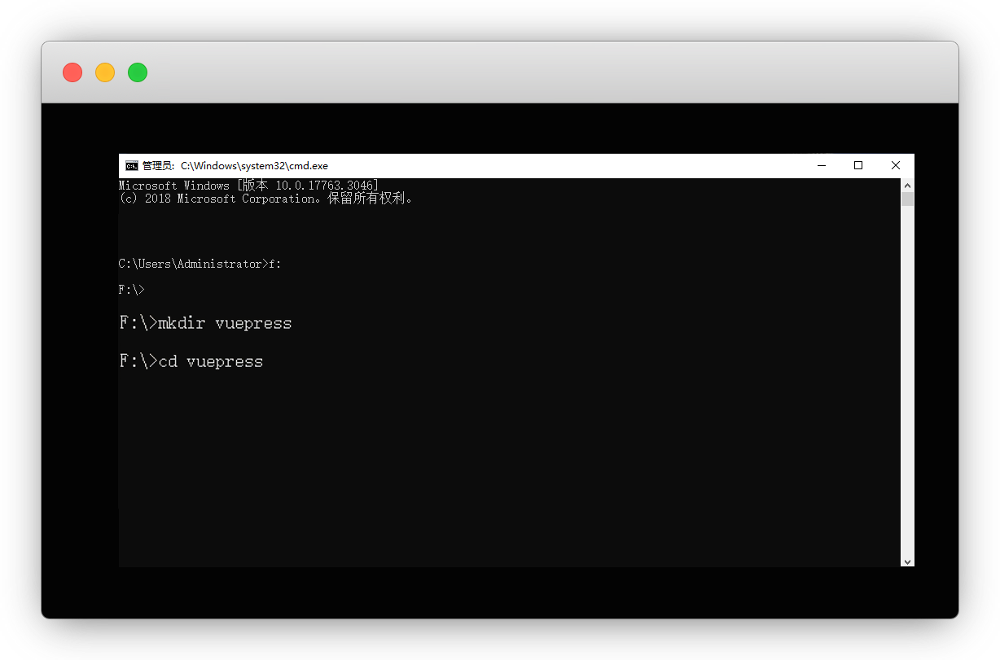
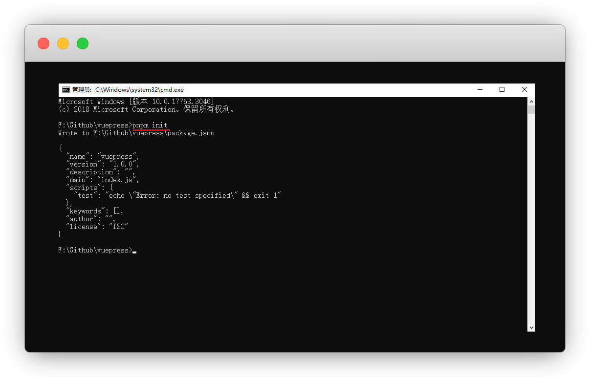
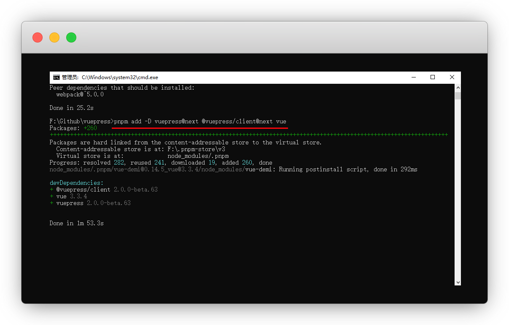
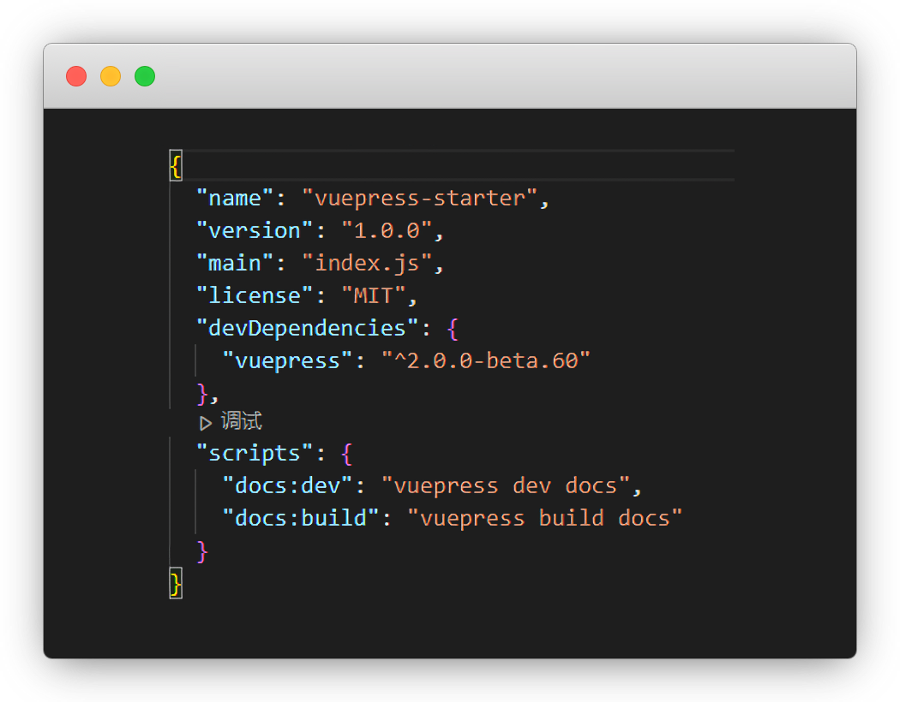
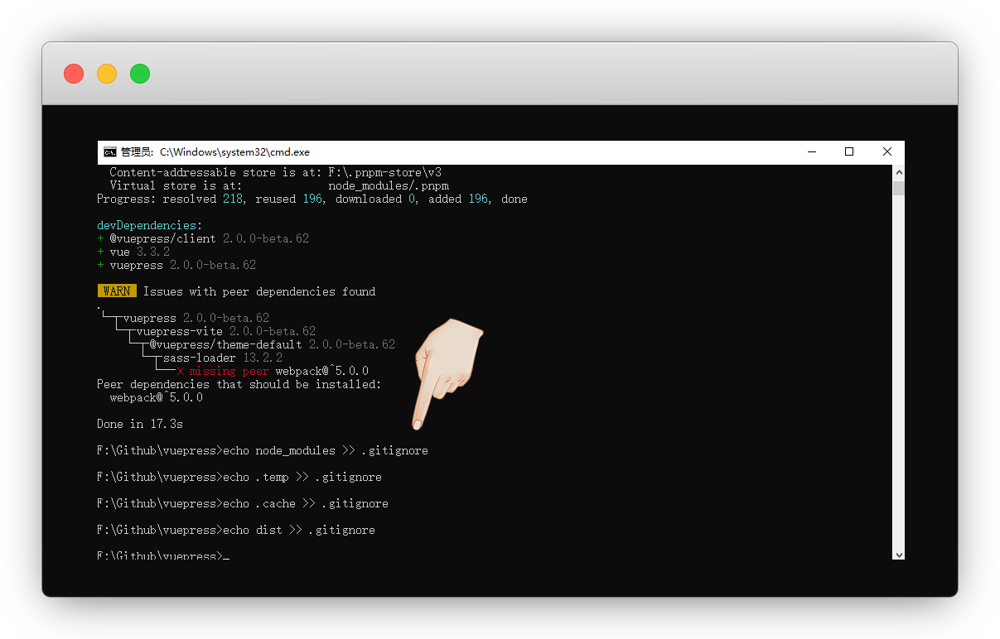
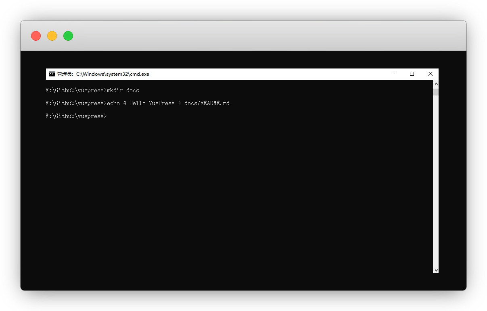
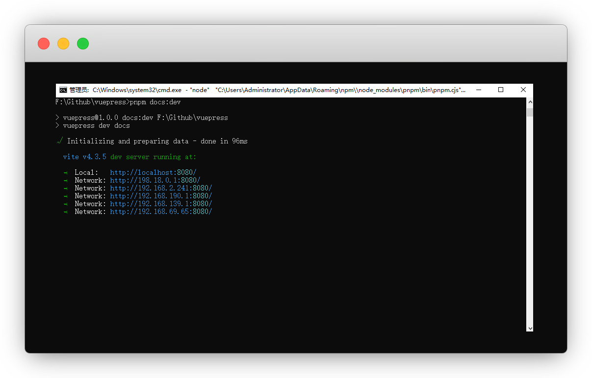
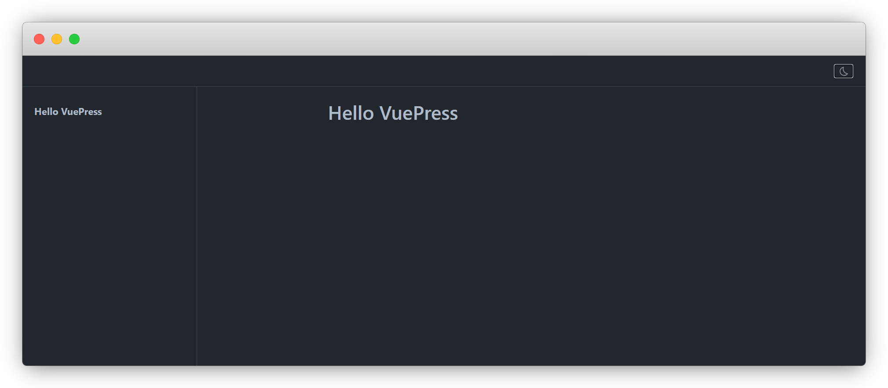

---
prev:
  text: 前言
  link: /guide/
---

# 快速上手

> 最近更新：2023-11-15


那我们就来学习如何的搭建vuepress，就是你现在看到的这种文档网站


## 前期准备

### 工具

::: tip 说明
已经安装 或者 熟练了，可以不用看此步骤
:::

* 必装：[安装nodejs](https://yiov.top/website/nodejs#window%E5%AE%89%E8%A3%85)


* 建议安装：[安装vscode](https://yiov.top/daily/VSCode/)


* 可选安装：[安装git](https://yiov.top/daily/git)


### pnpm

通过 npm 安装 [yarn](https://www.yarnpkg.cn/) 或者 新出的[pnpm](https://pnpm.io/zh/)


:::: code-group
::: code-group-item pnpm
```sh
#安装pnpm
npm install -g pnpm
#查看版本号
pnpm -v
```
:::
::: code-group-item yarn
```sh
#安装yarn
npm install -g yarn
#查看版本号
yarn -v
```
:::
::::


### 创建目录

win键+R键，调出命令运行框，输入 `cmd`


先进入任意盘符，比如 F 盘

```sh
#盘符可以自定义 回车进入
f:
```


再创建文件夹名


```sh
#目录可以自定义
mkdir vuepress

#目录和上面保持一致
cd vuepress
```

::: tip 说明
这样我的目录路径为 `F:\vuepress`

觉得麻烦的可以直接电脑创建
:::





## 开始安装

::: tip 说明
我们在目录上方的地址栏输入 `cmd` 可以快捷打开
:::

### 初始化

:::: code-group
::: code-group-item pnpm
```sh
#初始化pnpm
pnpm init
```
:::
::: code-group-item yarn
```sh
#初始化yarn 一路回车
yarn init

#或者用一键y命令
#yarn init -y
```
:::
::: code-group-item npm
```sh
#初始化npm
npm init
```
:::
::::





### 安装依赖

::: tip vite说明
从v2版本开始，默认使用的是 [Vite](https://vitejs.dev/) 打包工具，[webpack](https://webpack.js.org/)编译慢，不建议使用
:::


:::: code-group
::: code-group-item pnpm
```sh
pnpm add -D vuepress@next @vuepress/client@next vue
```
:::
::: code-group-item yarn
```sh
yarn add -D vuepress@next
```
:::
::: code-group-item npm
```sh
npm install -D vuepress@next
```
:::
::::





### 脚本命令

在 `package.json` 中添加一些 scripts 命令，保存

```json{2-3}
  "scripts": {
    "docs:dev": "vuepress dev docs",
    "docs:build": "vuepress build docs"
  }
```

::: tip 命令讲解
执行命令 `docs:dev`，就会运行 `vuepress dev docs`

执行命令 `docs:build`，就会运行 `vuepress build docs`
:::




### git忽略项

添加 `.gitignore` 文件，主要用于上传到gitee/github的忽略项

::: warning 注意
分别将 依赖文件 / 临时目录 / 缓存目录 / 静态目录 添加到.gitignore文件中

建议先使用cmd，使用vscode有可能会出现乱码
:::

```sh
echo node_modules >> .gitignore

echo .temp >> .gitignore

echo .cache >> .gitignore

echo dist >> .gitignore
```



::: details Github上传未忽略dist文件夹
原因：vscode输入命令导致编码错误

解决：Github Desktop - Repository settings - ignored files

输入我们忽略的dist文件即可，save保存即可

```
node_modules
.temp
.cache
dist
```
:::


### 创建文档

::: warning 注意
建议先使用cmd，使用vscode有可能会出现乱码
:::

创建你的第一篇文档

```sh
mkdir docs
echo # Hello VuePress > docs/README.md
```





## 本地启动

在本地启动服务器，进入开发环境来搭建文档网站。本次执行的其实就是我们在 [脚本命令](#脚本命令) 中的命令


:::: code-group
::: code-group-item pnpm
```sh
pnpm docs:dev
```
:::
::: code-group-item yarn
```sh
yarn docs:dev
```
:::
::: code-group-item npm
```sh
npm docs:dev
```
:::
::::

::: tip 如何退出
`ctrl+c` 即可退出开发模式
:::


VuePress会在本地启动一个8080端口的热重载开发服务器，即当你修改文件时，浏览器中的内容也会自动更新

`http://localhost:8080`



打开网址成功看到页面，就说明我们的vuepress就搭建完成了

::: warning 注意
接下来我们可以关闭cmd，全程用vscode了
:::



