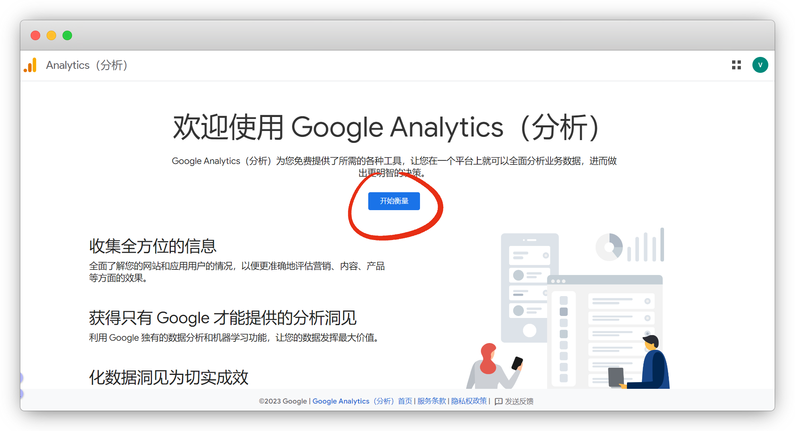
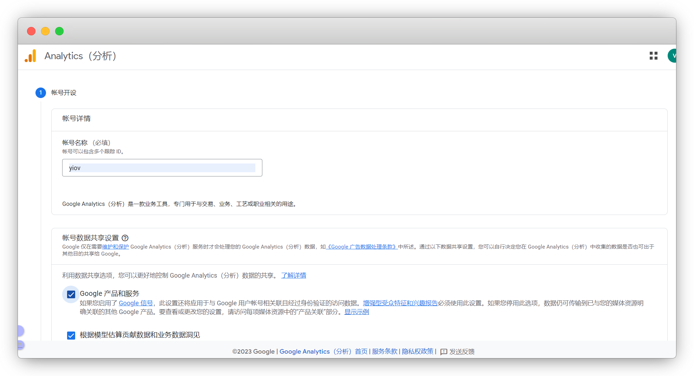
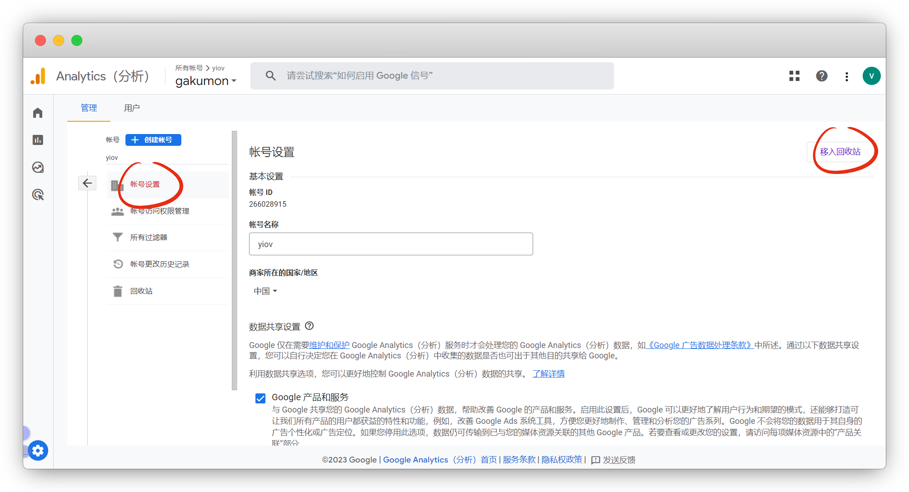

# 插件

::: warning 更新时间
最近更新：2023-9-11

搭建版本：v2.0-beta.67
:::


::: danger 特别说明
如果插件无法引入import，尝试关闭vscode后再打开

或者直接初始化，然后重新安装插件
:::


## Markdown高亮

使用内置插件 `Prism.js` 来为 Markdown 代码块启用高亮


::: danger 注意
不用另外装和配置，已经内置了除非你要改动，你就需要重新安装
:::

:::: code-group
::: code-group-item pnpm
```sh
pnpm add -D @vuepress/plugin-prismjs@next
```
:::
::: code-group-item yarn
```sh
yarn add -D @vuepress/plugin-prismjs@next
```
:::
::: code-group-item npm
```sh
npm i -D @vuepress/plugin-prismjs@next
```
:::
::::


```ts{1,5-8}
import { prismjsPlugin } from '@vuepress/plugin-prismjs'

export default {
  plugins: [
    //markdown代码高亮配置
    prismjsPlugin({
      preloadLanguages:['markdown', 'jsdoc', 'yaml']
    }),
  ],
}
```

::: warning 注意
在生产和构建时候会 `提示插件已经被使用多次` ，是因为已经内置了，你再装一个插件

默认使用你安装的，不影响打包
:::


## 站外链接文字

默认主题中，我们复制站外链接文字会出现多余的A11y文字

::: tip 比如
[Github](https://github.com/) 复制出来是 `GitHub open in new window`

怎么删除后面这个open in new window呢
:::

我们需要安装插件后进行配置，安装

:::: code-group
::: code-group-item pnpm
```sh
pnpm add -D @vuepress/plugin-external-link-icon@next
```
:::
::: code-group-item yarn
```sh
yarn add -D @vuepress/plugin-external-link-icon@next
```
:::
::: code-group-item npm
```sh
npm i -D @vuepress/plugin-external-link-icon@next
```
:::
::::


::: tip 说明
引号内留空就可以了，除非你想个性化
:::

```ts{1,5-14}
import { externalLinkIconPlugin } from '@vuepress/plugin-external-link-icon'

export default {
  plugins: [
    externalLinkIconPlugin({
      locales: {
        '/': {
          openInNewWindow: '在新窗口打开，不想要文字删掉留空即可',
        },
        '/en/': {
          openInNewWindow: 'open in new window',
        },
      },
    }),
  ],
}
```

::: warning 注意
在生产和构建时候会 `提示插件已经被使用多次` ，是因为已经内置了，你再装一个插件

默认使用你安装的，不影响打包
:::


另外站外链接图标不想要，可以用Frontmatter关闭当前页

::: tip 说明
所有页面都关闭，可参考 [官方文档](https://v2.vuepress.vuejs.org/zh/reference/default-theme/config.html#themeplugins-externallinkicon) ，但我并未生效
:::

```md
---
externalLinkIcon: false
---
```


## 谷歌分析

利用插件 [google-analytics](https://analytics.google.com/) ，来查看网站访问量


:::: code-group
::: code-group-item pnpm
```sh
pnpm add -D @vuepress/plugin-google-analytics@next
```
:::
::: code-group-item yarn
```sh
yarn add -D @vuepress/plugin-google-analytics@next
```
:::
::: code-group-item npm
```sh
npm i -D @vuepress/plugin-google-analytics@next
```
:::
::::


```ts
import { googleAnalyticsPlugin } from '@vuepress/plugin-google-analytics'

export default {
  plugins: [
    googleAnalyticsPlugin({
      id: 'G-XXXXXXXXXX', //跟踪ID
    }),
  ],
}
```

谷歌分析官网：[https://analytics.google.com/](https://analytics.google.com/)

点 `开始衡量`

::: tip 说明
没有账号的注册账号，要翻墙哦
:::



信息随便填，后面都可以改



创建完成，点网站，输入你自己的网站


衡量ID就是跟踪ID，我们填入 `config.ts`


如果不想要了，在账户设置里删除账户

::: tip 说明
删除了在回收站里，要35天后永久删除
:::




## 复制代码块

默认主题没有添加这个功能，我们可以用第三方插件

官网：[https://plugin-copy-code2.vuejs.press/zh/](https://plugin-copy-code2.vuejs.press/zh/)

安装

:::: code-group
::: code-group-item pnpm
```sh
pnpm add -D vuepress-plugin-copy-code2
```
:::
::: code-group-item yarn
```sh
yarn add -D vuepress-plugin-copy-code2
```
:::
::: code-group-item npm
```sh
npm i -D vuepress-plugin-copy-code2
```
:::
::::


```ts{1,5-7}
import { copyCodePlugin } from 'vuepress-plugin-copy-code2'

export default {
  plugins: [
    copyCodePlugin({
      showInMobile: true, //是否显示在移动端
    }),
  ],
};
```


## 更多插件

* VuePress 插件市场：[https://marketplace.vuejs.press/zh/](https://marketplace.vuejs.press/zh/) 丨 [文档版](https://github.com/vuepress/awesome-vuepress/blob/main/v2.md)


